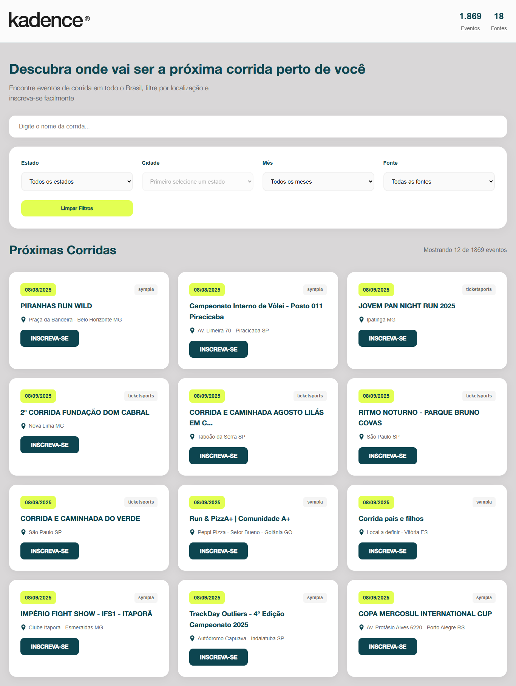

# 🏃 Kadence — Encontre sua próxima corrida

Agregador de corridas de rua no Brasil.  

Lê uma planilha pública (CSV) do Google Sheets e monta cards de eventos com busca e filtros (UF, cidade, mês e fonte), exibindo link direto de inscrição.

---

\## ✨ Destaques

\- \*\*Fonte de dados única (CSV público):\*\* basta trocar a constante `PLANILHA\_CSV` para apontar sua planilha.  

&nbsp; O carregamento usa `fetch` com `{ cache: 'no-store' }` para evitar cache agressivo.

\- \*\*Busca e filtros inteligentes:\*\*

&nbsp; - Busca por título com normalização (acentos/maiúsculas)

&nbsp; - Estado (UF) e Cidade (habilita após escolher um estado)

&nbsp; - Mês (01–12) e Fonte (com nomes “bonitos”)

\- \*\*Endereços bagunçados?\*\* Sem crise: heurísticas extraem cidade e UF mesmo com endereços despadronizados (ex.: “Estádio X, Bairro Y — Araguari - MG”).

\- \*\*Link de inscrição confiável:\*\* seleção do “melhor link” entre várias colunas do CSV (URL válida, domínio reconhecido e termos como “inscrição/ingresso”).

\- \*\*Paginação incremental:\*\* 12 cards por página + botão “Carregar mais eventos”.

- \*\*Contadores no topo:\*\* total de Eventos e de Fontes.

---

## 🖼️ Print do Projeto

### Tela Inicial

---

\## 🧠 Como funciona (pipeline)

1\. Carrega CSV da planilha pública → faz parsing robusto de linhas e colunas.  

2\. Normaliza e enriquece:

&nbsp;  - Datas (parse flexível + formatação pt-BR)

&nbsp;  - Cidade/UF (regras para “provar” que um trecho é cidade)

&nbsp;  - Fonte (normaliza domínio e aplica rótulos legíveis)

3\. Cria cards com título, data, local e botão \*\*INSCREVA-SE\*\* (`target="\_blank"`).

4\. Renderiza e pagina com “Carregar mais” e atualiza contadores/resultados.

---

\## 📁 Estrutura

/ (raiz)

├─ index.html # Estrutura, filtros e containers dos cards/contadores

├─ script.js # Lógica de importação, parsing, filtros e renderização

├─ styles.css # Estilos (referenciado no index.html)

└─ imagens/ # Logotipos, prints e ícones (ex: inicio.png)

---

\## 🧪 Rodando localmente

1\. Clone este repositório.

2\. Abra `index.html` em um \*\*servidor estático\*\*  

&nbsp;  (exemplo: `npx http-server` ou extensão Live Server do VSCode).

3\. (Opcional) Troque a URL da constante `PLANILHA\_CSV` para usar sua própria planilha.

---

\## ⚙️ Configuração

\- \*\*Planilha:\*\* publique sua planilha como CSV e cole a URL na constante `PLANILHA\_CSV`.

\- \*\*Filtros disponíveis:\*\* Estado, Cidade (só habilita após Estado), Mês e Fonte.

\- Campo de busca com normalização por nome de corrida.

---

\## 🛣️ Roadmap (ideias futuras)

\- Salvar filtros na URL (deep-link)

\- Mapa com geocodificação opcional

\- Marcar favoritos com `localStorage`

\- PWA para instalação em mobile

---

\## 🪪 Licença

MIT — use, modifique e contribua livremente.

\*\*Créditos técnicos:\*\* HTML sem framework, JavaScript vanilla para data pipeline, heurísticas e UI.  

A listagem e os filtros são construídos dinamicamente no cliente, sem backend.

